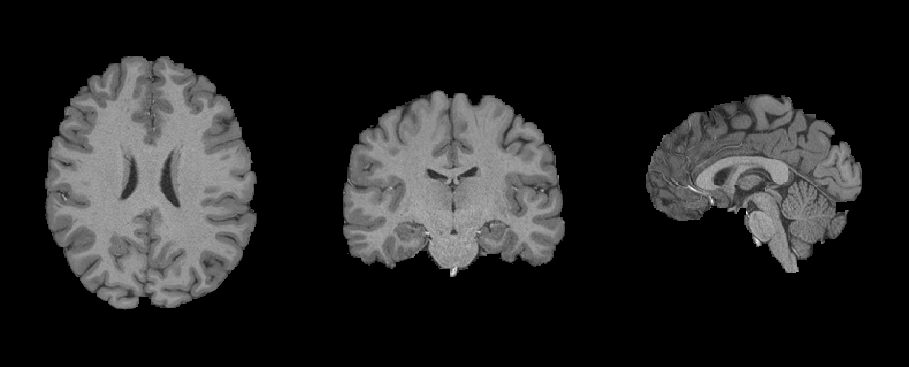
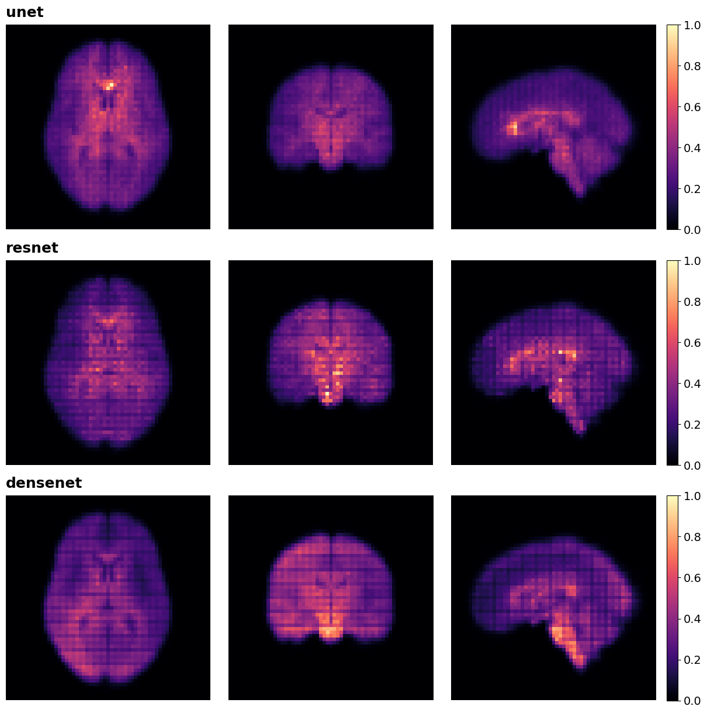
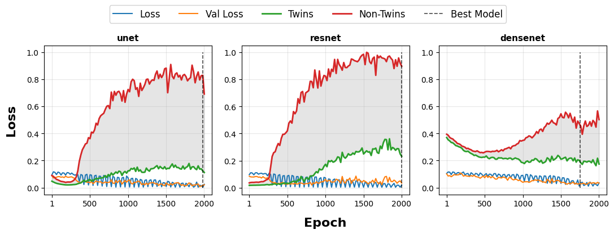
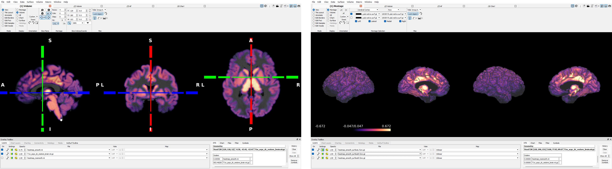

# Siamese Network Embeddings for Brain Region Ranking in MRI Twin Identification

[](https://drive.google.com/drive/folders/1AT22UDsgiR6NRpqpN0CBJRxVZWEFfX68?usp=sharing)

Deep learning framework for identifying genetic similarity in brain MRI data using Siamese networks with Layer-Wise Relevance Propagation (LRP) analysis.

## Overview

- **Identifies monozygotic twins** from brain MRI scans using 3D CNN Siamese networks
- **Ranks brain regions** by discriminative importance for genetic relatedness detection  
- **Provides interpretable results** through Layer-Wise Relevance Propagation analysis

## Dataset

- **Source**: Human Connectome Project S1200 Data Release
- **Subjects**: 138 monozygotic twin pairs (276 subjects)
- **Resolution**: T1-weighted images (260 × 311 × 260 voxels)
- **Processing**: Downscaled to 86 × 103 × 86 for training



## Architecture

- **Three 3D CNN backbones**: Modified U-Net, ResNet-18, and DenseNet-121
- **Siamese network design** with 128-dimensional embeddings
- **Triplet loss optimization** with hard negative mining
- **LRP attribution analysis** for spatial interpretation



## Performance

| Architecture | F1-Score | AUC-ROC |
|--------------|----------|---------|
| U-Net        | 92.0%    | 95.2%   |
| ResNet-18    | 89.5%    | 93.7%   |
| DenseNet-121 | 87.3%    | 92.1%   |



## Connectome Workbench Clinical Integration

- **Medical format conversion**: Automated NIfTI and GIFTI format generation
- **Subject-specific atlas generation**: HCP-MMP 1.0 parcellation in native T1w space
- **GIFTI surface formats**: Cortical mapping for detailed hemisphere-specific visualization



## Installation

```bash
# Clone repository
git clone https://github.com/matthewkenely/3d-siamese-twin-ranking.git
cd 3d-siamese-twin-ranking

# Install dependencies
pip install -r requirements.txt

# Download pre-trained models
# Available at: https://drive.google.com/drive/folders/1AT22UDsgiR6NRpqpN0CBJRxVZWEFfX68?usp=sharing
```

## Citation

```bibtex
TBD
```
